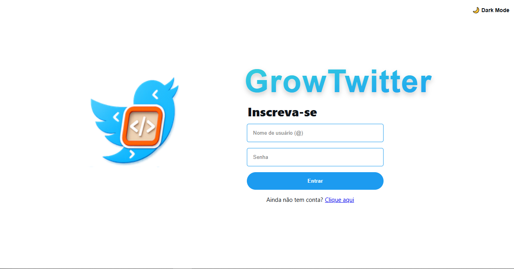
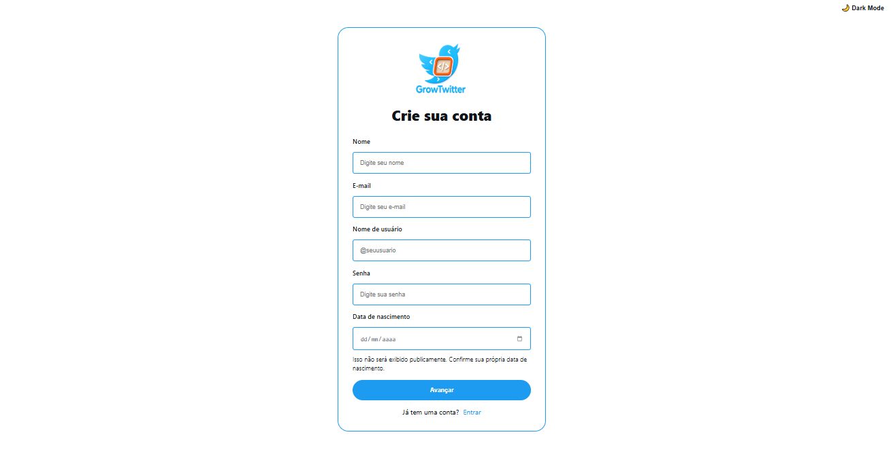
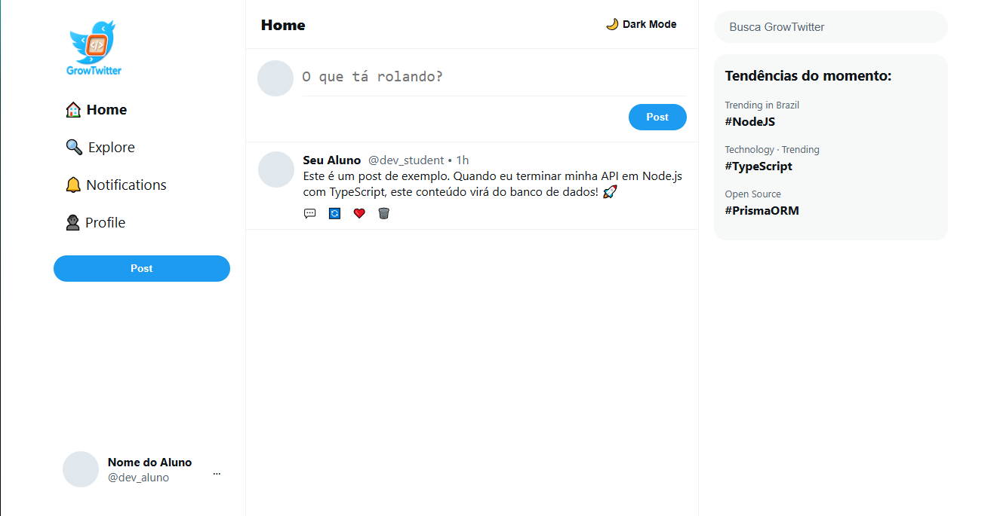

# 🐦 GrowTwitter

Aplicação inspirada no Twitter desenvolvida durante o curso de Formação em Desenvolvimento Web Back-End com Node.js e C# (GrowDev).

---

## 🚀 Tecnologias

● Node.js
● Typescript
● Express.js
● API Rest
● Programação Orientada a Objetos
● PostgreSQL
● PrismaORM
● HTML, CSS e JavaScript

---

## 💻 Funcionalidades

- Cadastro de usuário ✅ concluído
- Login e autenticação ✅ concluído
- Criar posts, associado ao usuario logado ✅ concluído
- Atualizar posts ✅ concluído
- Deletar posts ✅ concluído
- Reply posts (em desenvolvimento)
- Visualizar feed (timeline) (em desenvolvimento)
- Sistema de perfil de usuário (em desenvolvimento)
- Explorar conteúdos (em desenvolvimento)
- Autenticação com JWT (em desenvolvimento)

---

## 📸 Preview




---

## ⚙️ Como rodar o projeto

```bash
# clonar repositório
git clone https://github.com/MattDeveloper94/growtwitter_growdev.git

# entrar na pasta
cd growtwitter_growdev

# instalar dependências
npm install

# rodar servidor
npm run dev
```
